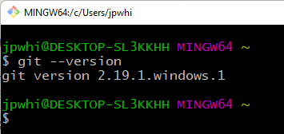
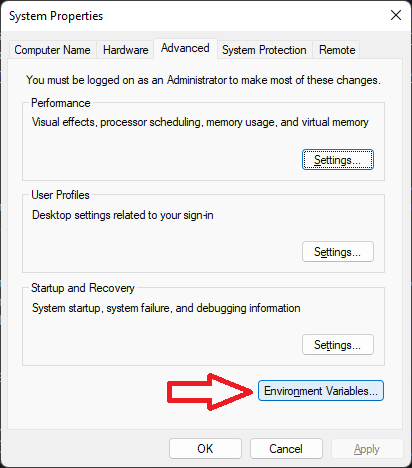
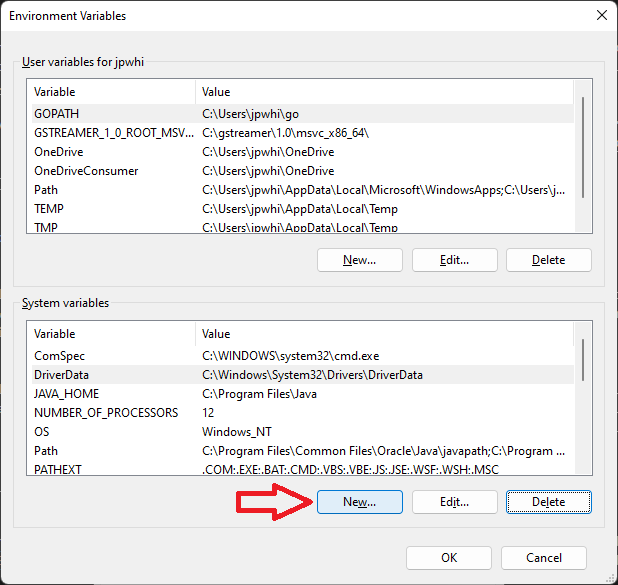
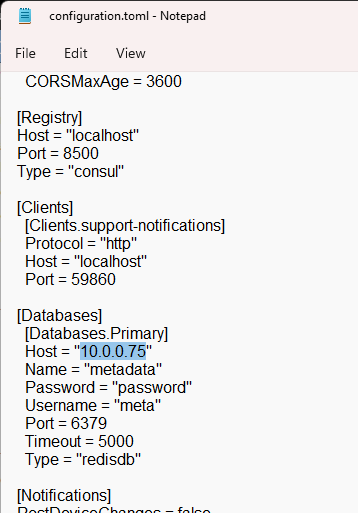
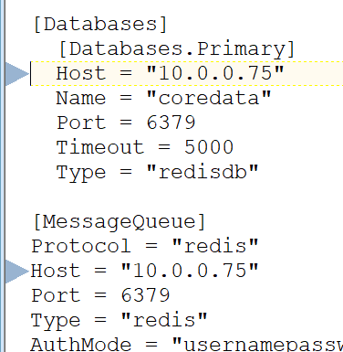
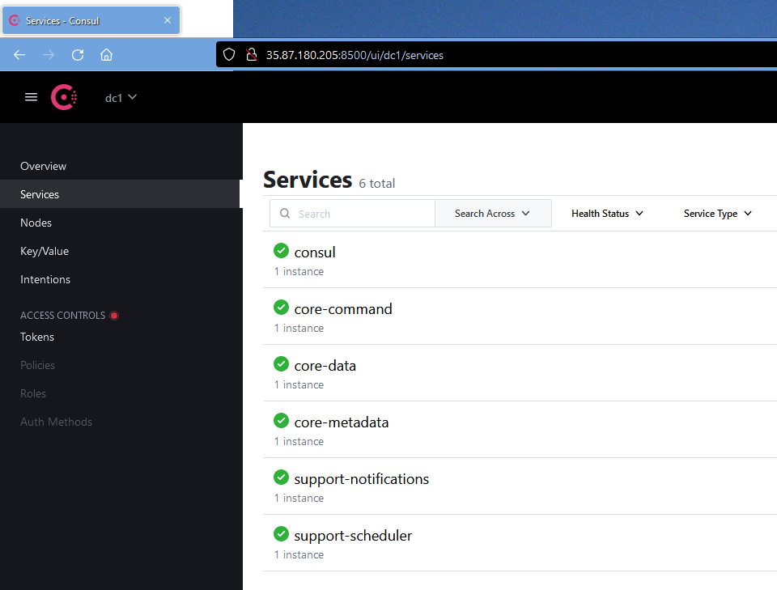
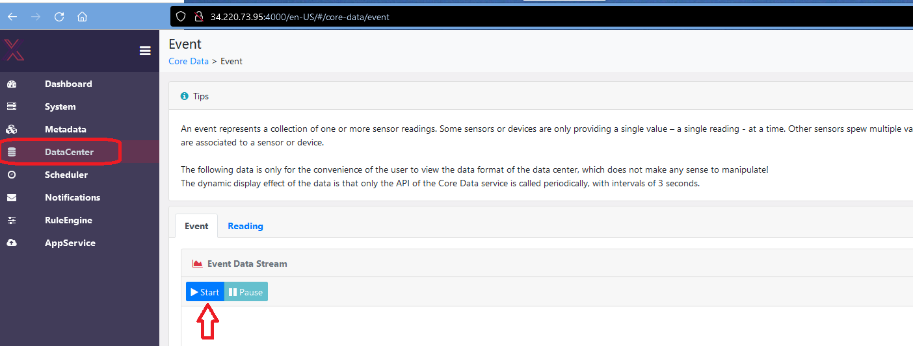

# Build and Run on Windows on x86/x64

!!! Warning
    This build and run guide offers some assistance to seasoned developers or administrators to help build and run EdgeX on Windows natively (not using Docker and not running on [Windows Subsystem for Linux](https://docs.microsoft.com/en-us/windows/wsl/about) ) but running natively on Windows is **not supported by the project**.  EdgeX was built to be platform independent.  As such, we believe most of EdgeX can run on almost any environment (on any hardware architecture and almost any operating system).  However, there are elements of the EdgeX platform that will not run on Windows.  Specifically, Redis, Kong and eKuiper will not run on Windows natively.  Additionally, there are a number of device services that will not work on EdgeX.  In these instances, developers will need to find workarounds to these services or run them outside of Windows and access them across the network.
    
    Existence of this guides **does not imply current or future support**.  Use of this guides should be used with care and with an understanding that it is the community's best effort to provide advanced developers with the means to begin their own custom EdgeX development and execution on Windows.

This build and run guide shows you how to get, compile/build, execute and test EdgeX (including the core and supporting services, the configurable application service, and a virtual device service) on Windows x86_64 hardware.  Specifically, this guide was done using [Windows 11](https://www.microsoft.com/en-us/windows/windows-11).  It is believed that this same guide works for Windows 10.

## Environment

Building and running EdgeX on Windows natively will require you have:

- Windows 11 (or Windows 10)
- Access from the host machine to the Internet in order to get tools and source code (e.g., to clone code from GitHub)
- x86/x64 hardware platform (multiple CPUs are not necessary, but performance will vary greatly depending on resources)
- Sufficient memory to build and run EdgeX micro services ([EdgeX suggests](../general/../../general/PlatformRequirements.md) 1GB minimum.)
    - 1GB is sufficient memory to run all the required software as well as build/run EdgeX services listed below
- Sufficient disk space to pull the required tools, libraries, code, etc. to build and run EdgeX ([EdgeX suggests](../general/../../general/PlatformRequirements.md) 10GB minimum )
    - 10GB is inclusive of space needed to download and setup all the required software/tools as well as EdgeX

## Required Software

The following software is assumed to already be installed and available on the host platform.  Follow the referenced guides if you need to install or setup this software.

- Go Lang, version 1.17 or later as of the Kamakura release
    - See [Go Download and install guide for help](https://go.dev/doc/install)
    - How to check for existence and version on your machine

        
 
- Consul, version 1.10 or later as of the Kamakura release
    - See [Open Source Consul for help](https://www.consul.io/)
    - How to check for existence and version on your machine

        

- Git for Windows version 2.10 (that provides a BASH emulation to run Git from the command line)
    - See [Git for Windows]](https://gitforwindows.org/)
    - How to check for existence and version on your machine

        

You will also need GCC (for C++), and Make.  These can be provided via a variety of tools/packages in Windows.  Some options include use of:

- [Visual Studio](https://visualstudio.microsoft.com/)
- [Cygwin](https://www.cygwin.com/)
- [MinGW/MinGW-W64](https://www.mingw-w64.org/downloads/)

Redis will not run on Windows, but is required in order to run EdgeX.  You Windows platform must be able to connect to a Redis instance on another platform via TCP/IP on port 6379 (by default). Redis,version 6.2 or later as of the Kamakura release.  As an example, see [How to install and configure Redis on Ubuntu 20.04](https://linuxize.com/post/how-to-install-and-configure-redis-on-ubuntu-20-04/).  

Because EdgeX on your Windows platform will access Redis on another host, Redis should be configured to allow for traffic from other machines, you'll need to allow access from other addresses (see [Open Redis port for remote connections](https://stackoverflow.com/questions/19091087/open-redis-port-for-remote-connections)).  Additionally, you will need to configure EdgeX to use a username/password to access Redis, or set Redis into unprotected mode (see [Turn off 'protected-mode' in Redis](https://serverfault.com/questions/861519/how-to-turn-off-protected-mode-in-redis))


## Prepare your environment

!!! Info
    As you have installed Git for Windows, you will notice that all commands are executed from the Git BASH emulator.  This is the easiest way to build and run EdgeX on Windows.  You will also find that the instructions closely parallel build and run operations in Linux or other OS.  When referring to the **"terminal"** window throughout these instructions, this means use the Git BASH emulator window.


In this guide, you will be building and running EdgeX in "non-secure" mode.  That is, you will be building and running the EdgeX platform without the security services and security configuration.  An environmental variable, `EDGEX_SECURITY_SECRET_STORE`,  is set to indicate whether the EdgeX services are expected to initialize and use the secure secret store.  By default, this variable is set to `true`.  Prior to building and running EdgeX, set this environment variable to false.  You can do this in each terminal window you open by executing the following command:

``` Shell
export EDGEX_SECURITY_SECRET_STORE=false 
```

This can be done in the Git BASH (aka terminal) window from which you will eventually build and run EdgeX. 

If you prefer, you can also set a Windows Environment Variable.  Open the `System Properties` Window, then click on the `Environmental Variables` button to add a new variable.



In the Environment Variables Window that comes up, click on the `New...` button under the System variables section.  Enter `EDGEX_SECURITY_SECRET_STORE` in the `Variable Name` field and `false` in the `Variable value` field of the `New System Variable` popup.  Click `OK` to close the `System Properties` and `Environment Variables` windows.  




Now, each time you open a terminal window, the `EDGEX_SECURITY_SECRET_STORE` will already be set to `false` for you without having to execute the export command above.

## Download EdgeX Source

In order to build and run EdgeX micro services, you will first need to get the source code for the platform.  Using git, clone the EdgeX repositories with the following commands:

!!! Tip
    You may wish to create a new folder and then issue these git commands from that folder so that all EdgeX code is neatly stored in a single folder.

``` Shell
git clone https://github.com/edgexfoundry/edgex-go.git
git clone https://github.com/edgexfoundry/device-virtual-go.git
git clone https://github.com/edgexfoundry/app-service-configurable.git
git clone https://github.com/edgexfoundry/edgex-ui-go.git
```

Note that a new folder, named for the repository, gets created containing source code with each of the git clones above.

!!! Note
    eKuiper will not run on Windows natively.  As with Redis, if you want to use eKuiper, you will need to run eKuiper outside of Windows and communicate via TCP/IP on a connected network.

!!! Warning
    These git clone operations pull from the main branch of the EdgeX repositories.  This is the current working branch in EdgeX development.  See the [git clone documentation](https://git-scm.com/docs/git-clone) for how to clone a specific named release branch or version tag.

## Build EdgeX Services

With the source code, you can now build the EdgeX services and the GUI.  

### Build Core and Supporting Services

Most of the services are in the `edgex-go` folder.  This folder contains the code for the [core](../../microservices/core/Ch-CoreServices.md) and [supporting](../../microservices/support/Ch-SupportingServices.md) services.  A single command in this repository will build several of the services.

Enter the `edgex-go` folder and issue the `make build` command as shown below.


!!! Note
    Building the services in edgex-go folder will actually build some of the services (such as the security services) not used in this guide, but issuing a single command is the easiest way to build the services needed without having to build services one by one.

### Build the Virtual Device Service

The [virtual device service](../../microservices/device/virtual/Ch-VirtualDevice.md) simulates devices/sensors sending data to EdgeX as if it was a "thing".  This guide uses the virtual device service to exemplify how other devices services can be built and run.

Enter the `device-virtual-go` folder and issue the `make build` command as shown below.


### Build the Configurable Application Service

The [configurable application service](../../microservices/application/AppServiceConfigurable.md) helps prepare device/sensor data for enterprise or cloud systems.  It also prepares data for use by the rules engine - [eKuiper](../../microservices/support/eKuiper/Ch-eKuiper.md)

Enter the `app-service-configurable` folder and issue the `make build` command as shown below.


### Build the GUI

EdgeX provides a [graphical user interface](../tools/Ch-GUI.md) for exploring a single instance of the EdgeX platform.  The GUI makes it easier to work with EdgeX and see sample data coming from sensors.  It provides a means to check that EdgeX is working correctly, monitor EdgeX and even make some configuration changes.

Enter the `edgex-ui-go` folder and issue the `make build` command as shown below.


## Run EdgeX

Provided everything built correctly and without issue, you can now start your EdgeX services one at a time.  First make sure Redis Server is running on its host machine and is accessible via TCP/IP (assuming default port of 6379).  If Redis is not running, start it before the other services.  If it is running, you can start each of the EdgeX services **in order** as listed below.

### Point Services to Redis

Because Redis is not running on your Windows machine, the configuration of all the services need to be changed to point the services to Redis on the different host when they start.

#### Modify the Configuration of EdgeX Core and Supporting Services

Each of core and supporting EdgeX services are located in `edgex-go\cmd` under a subfolder by the service name.  In the first case, core-metadate is located in `edgex-go\cmd\core-metadata`.  Core-metadata's configuration is located in a `configuration.toml` file in `edgex-go\cmd\core-metadata\res`.  Use your favorite editor to open the configuration file and locate the `Databases.Primary` section in that file (about 1/2 the way down the configuration listings).  Change the host address from `localhost` to the IP address of your Redis hosting machine (changed to 10.0.0.75 in the example below).



Modify the host location for Redis in the `Databases.Primary` section of `configuration.toml` files for notifications (`edgex-go\cmd\support-notifications\res`) and scheduler (`edgex-go\cmd\support-scheduler\res`) services in the same way.

In core-data, you need to modify two host settings.  You need to change the location for Redis in the `Databases.Primary` section as well as the host location for Redis in the `MessageQueue` section of `configuration.toml`.  The latter setting is for accessing the Redis Pub/Sub message bus.



### Modify the configuration of the EdgeX Configurable App Service

The Configurable App Service uses both the Redis database and message bus like core-data does.  Locate the `configuration.toml` file in `app-service-configurable\res\rules-engine` folder.  Open the file with an editor and change the Host in the `Database`, `Trigger.EdgexMessageBus.SubscribeHost`, and `Trigger.EdgexMessageBus.PublishHost` sections from `localhost` to the IP address of your Redis hosting machine.

### Modify the configuration of the EdgeX Virtual Device Service

The Virtual Device Service uses the Redis message bus like core-data does.  Locate the `configuration.toml` file in `device-virtual-go\cmd\res` folder.  Open the file with an editor and change the Redis `MessageQueue` host address from `localhost` to the IP address of your Redis hosting machine.

### Start Consul

Wherever you installed Consul, start Consul Agent with the following command.

``` Shell
consul agent -ui -bootstrap -server -data-dir=tmp/consul &
```

If Consul is running correctly, you should be able to reach the Consul UI through a browser at http://localhost:8500 on your Windows machine.


### Start Core Metadata

Each of core and supporting EdgeX services are located in `edgex-go\cmd` under a subfolder by the service name.  In the first case, core-metadate is located in `edgex-go\cmd\core-metadata`.  In a Git BASH terminal, change directories to the core-metadata service subfolder and then run the executable found in the subfolder with `-cp` and `-registry` command line options as shown below.

``` shell
cd edgex-go/cmd/core-metadata/
nohup ./core-metadata -cp=consul.http://localhost:8500 -registry &
```

The `nohup` is used to execute the command and ignore all SIGHUP (hangup) signals.  The `&` says to execute the process in the background.  Both `nohup` and `&` will be used to run each of the services so that the same terminal can be used and the output will be directed to local nohup.out log files.

The `-cp=consul.http://localhost:8500` command line parameter tells core-metadata to use Consul and where to find Consul running.  The `-registry` command line parameter tells core-metadata to use (and register with) the registry service.  Both of these command line parameters will be use when launching all EdgeX services.

### Start the other Core and Supporting Services

In a similar fashion, enter each of the other core and supporting service folders in `edgex-go\cmd` and launch the services.

```Shell
cd ../core-data
nohup ./core-data -cp=consul.http://localhost:8500 -registry &
cd ../core-command
nohup ./core-command -cp=consul.http://localhost:8500 -registry &
cd ../support-notifications/
nohup ./support-notifications -cp=consul.http://localhost:8500 -registry &
cd ../support-scheduler/
nohup ./support-scheduler -cp=consul.http://localhost:8500 -registry &
```

!!! Tip
    If you still have the Consul UI up, you should see each of the EdgeX core and supporting services listed in Consul's `Services` page with green check marks next to them suggesting they are running.

    

### Start Configurable Application Service

The configurable application service is located in the root of `app-service-configurable` folder.


The configurable application service is started in a similar way as the other EdgeX services.  The configurable application service is going to be used to route data to the rules engine.  Therefore, an additional command line parameter (`p`) is added to its launch command to tell the app service to use the rules engine configuration and profile.

```Shell
nohup ./app-service-configurable -cp=consul.http://localhost:8500 -registry -p=rules-engine &
```

### Start the Virtual Device Service

The virtual device service is also started in similar way as the other EdgeX services.  The virtual device service manufactures data as if it was to come from a sensor and sends that data into the rest of EdgeX.  By default, the virtual device service will generate random numbers (integers, unsigned integers, floats), booleans and even binary data as simulated sensor data.  The virtual device service is located in the `device-virtual-go\cmd` folder.  


Change directories to the virtual device service's `cmd` folder and then launch the service with the command shown below.

```Shell
nohup ./device-virtual -cp=consul.http://localhost:8500 -registry &
```

### Start the GUI

The EdgeX graphical user interface (GUI) provides an easy to use visual tool to monitor data passing through EdgeX services.  It also provides some capability to change an EdgeX instance's configuration or metadata.  The EdgeX GUI is located in the `edgex-ui-go\cmd\edgex-ui-server` folder.


Change directories to the GUI's `cmd\edgex-ui-server` folder and then launch the GUI with the command shown below.

```Shell
nohup ./edgex-ui-server &
```

If the GUI is running correctly, you should be able to reach the GUI through a Window's browser at http://localhost:4000.  It may take a few seconds for the GUI to initialize once you hit the URL.


!!! Note
    Some elements of the GUI will not work as you do not have all available EdgeX services running.  Notably, the System Management service and its executor are not running so the System view of the GUI will display an error.  By default, the System Management service and its executor operate by checking on the other services memory, CPU, etc. via Docker Stats.  In this case, since you are not running Docker containers, the System Management service would not function.  Also, as eKuiper does not run on Windows, any Rules Engine functionality will not work either.

## Test and Explore EdgeX

With EdgeX up and running (inclusive of Consul, and with Redis running on a separate host), you can try these quick tests to see that EdgeX is running correctly.

### See sensor data flowing through EdgeX

You have already been using Consul and the EdgeX GUI to check on some items of EdgeX in this tutorial.  You can use the EdgeX GUI to further check that sensor data is flowing through the system.

In your Window's browser, go to http://localhost:4000.  Remember, it may take a few seconds for the GUI to initialize once you hit the URL.  Once the GUI displays, find and click on the `DataCenter` link on the left hand navigation bar (highlighted below).



The `DataCenter` display allows you to see the EdgeX event/readings as they are persisted by the core data service to Redis.  Simply press the `>Start` button to see the "stream" of simulated sensor data that was generated by the virtual device service and sent to EdgeX. The simulated data may take a second or two to start to display in the `EventDataStream` area of the GUI.


Press the `Pause` button to stop this display of data.  Notice that you can see the EdgeX Events (and associated Readings) or just the Readings with the two tabs on this `DataCenter` display.

### Check EdgeX service API

Each EdgeX micro service has a REST API associated with it.  You can use curl or a browser to test that the service is up using its `ping` API.  Below are curl commands to "ping" both core data and core metadata.

``` Shell
  curl http://localhost:59880/api/v2/ping
  curl http://localhost:59881/api/v2/ping
```

Each service should respond with JSON data to indicate it is able to respond to requests.  Below is an example response from the core metadata "Ping" request.

``` JSON
{"apiVersion":"v2","timestamp":"Thu May 12 23:25:04 UTC 2022","serviceName":"core-metadata"}
```

See [the service port reference page](../general/../../general/ServicePorts.md) for a list of service ports to check the `ping` API of other services.

As an added test, use curl to get the count of the number of events persisted by core data with the command below (you can also use a browser with the URL to get the same).

``` Shell
curl http://localhost:59880/api/v2/event/count
```

The response will indicate a "count" of events stored (in this case 6270).

``` JSON
{"apiVersion":"v2","statusCode":200,"Count":6270}
```

!!! Info
    The full set of APIs for each service can be found in [SwaggerHub](https://app.swaggerhub.com/search?owner=EdgeXFoundry1).  You can use the documentation to test other APIs as well.

## Debugging and Troubleshooting

With the `nohup` command on each service, the log file contents are redirected to a file (`nohup.out`) in the directory where you started each service.  if you find that a service does not appear to be running or if it is running but not working correctly, check the `nohup.out` file for any errors or issues.  In the example below, the core data's `nohup.out` log file is explored.

