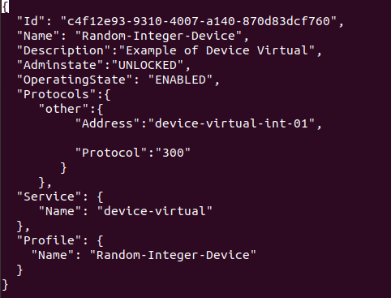

# Command Line Interface (CLI)

As of the Hanoi release (v1.3.0), EdgeX Foundry provides a command line interface tool.

## What is the EdgeX CLI?

EdgeX-CLI is a command line interface that provides a convenient way for interacting with EdgeX Foundry micro services. It abstracts away all the underling infrastructure and allows the user to easily execute commands. It removes the need to manually track micro services parameters like host and port, as well as knowing the exact request path.

It replaces the need to manually construct complex CURL commands. In particular, it helps with Post/Update requests (example: create a new event, or update a device) because the request body of these requests often include a lot of parameters. EdgeX-CLI provides an "interactive mode" that greatly simplifies the request constructing process. Commands that represent Post/Update requests leverage the interactive mode that opens the user's default editor with preloaded request scaffolding ready to be customized. The interactive mode also works with in-line parameters - allowing in-line values of the CLI command to get loaded in to the request scaffolding. 

EdgeX-CLI is an easy to use helper tool that benefits both EdgeX developers and users. This is the first release of the CLI with future enhancements planned.  Currently, the CLI only works in insecure mode (that is without the EdgeX API gateway protecting EdgeX services), but there is a lot more to come in future EdgeX releases.

## How to get the EdgeX CLI

Download the appropriate compressed file for your operating system containing the edgex-cli executable from [GitHub](https://github.com/edgexfoundry/edgex-cli/releases).

The Edgex-CLI is also publish in snap store (Snapcraft.io). To install the EdgeX CLI snap run:

```
sudo snap install edgex-cli
```

You can also get the source-code and then build and install edgex-cli from the source.  Again, find the source code on [GitHub](https://github.com/edgexfoundry/edgex-cli).

**For more information read see the tool's [README](https://github.com/edgexfoundry/edgex-cli/blob/master/README.md).**

## What can the CLI do?

The Edgex CLI covers most of the basic EdgeX Foundry APIs. Using the CLI, users can query all the available devices, profiles, services, events, readings etc. or query for a subset of them based on available flags – for example get devices with a specific name or get all events that belong to specific device.

It also provides the means to create EdgeX objects such as devices, profiles, etc.  Creating can be accomplished in three different ways:  
- By providing a file that contains the normal create object API request body
- By using inline parameters
- Or using interactive mode.

Some of the request bodies could contain a lot parameters and writing all them in one single line may not be convenient.  For these cases, the interactive mode used/or not altogether with inline parameters could be more convenient.


Updating EdgeX objects via the CLI can done in two ways:
 - By providing a file that contains the update API request body that would normally be used in the API call
 - Or by providing just the name of the object and, if the object with such name exists, enter into editor mode with the preloaded request body where you can change/edit just the fields that need to be modified. 

The available CLI capabilities, commands and option flags are too many to share here.  Use –help with the CLI to get more information.

## Example Usage

By default, the CLI results are printed out in tabular format, but by providing –v flag the result is printed in plain json format.  Here are some common CLI command examples, using the EdgeX device as the object, to show how to query, create, update and delete EdgeX objects.  The same CLI command principals generally apply for the other EdgeX objects (such as profile, services, events, readings, etc.) 

### List

You can easily get all the available EdgeX devices or get a device with a specific name.

``` bash
edgex-cli device list 
```


``` bash
edgex-cli device list – name Random-Integer-Device
```


``` bash
edgex-cli device list – name Random-Integer-Device -v
```


### Create
Here is an example of how the CLI's interactive mode can be used together with inline parameters to create the main structure of a new create device request. All provided inline parameters are already populated and the user is left to populate the rest of the needed values. 

``` bash
edgex-cli device add --description CLI-Device --profileName Random-Integer-Device --operatingStatus ENABLED -i      (--interactive)
```


### Update

When updating, the user default editor is opened containing the specified EdgeX device with specific name. You update the values of the fields that you want to be updated and leave the others.

!!! Note
    Please note that there are dedicated commands for updating device admin and operating state. 

``` bash
edgex-cli device update -n Random-Integer-Device
```



### Delete

Remove the object (in this case the device) by name or id.
``` bash
edgex-cli device rm -n sample-json
# Removed: sample-json
```

``` bash
edgex-cli device rm a5005e23-381a-4c69-a91d-ea299d993347
# Removed: a5005e23-381a-4c69-a91d-ea299d993347 
```
