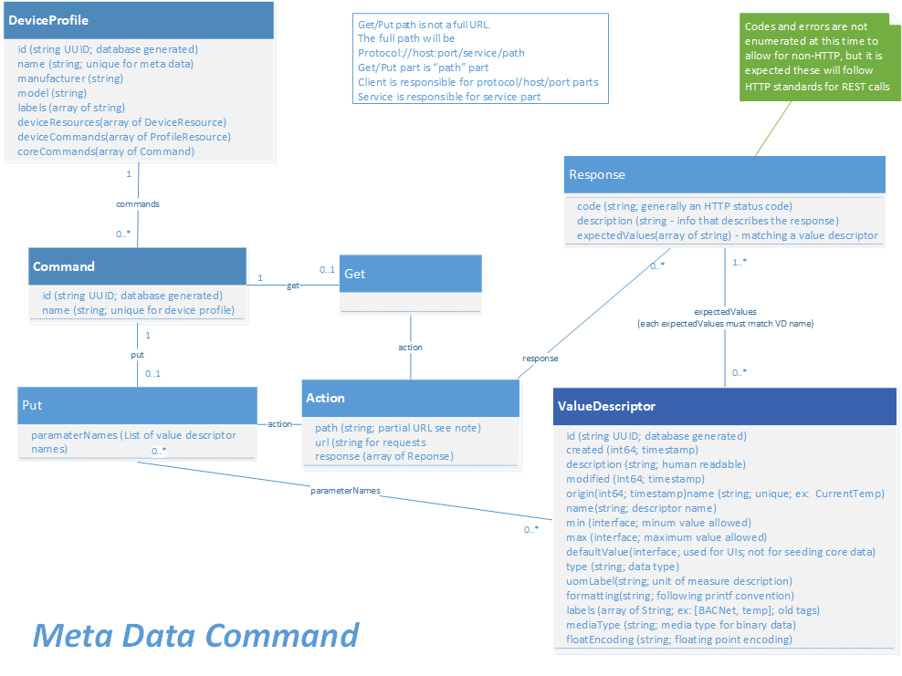

# Command

## Introduction

The command micro service (often called the command
and control micro service) enables the issuance of commands or actions to
[devices](../../../general/Definitions.md#device) on behalf of:

-   other micro services within EdgeX Foundry (for example, an [edge
    analytics](../../../general/Definitions.md#edge-analytics) or rules engine micro service)
-   other applications that may exist on the same system with EdgeX
    Foundry (for example, a management agent that needs to
    shutoff a sensor)
-   To any external system that needs to command those devices (for
    example, a cloud-based application that determined the need to
    modify the settings on a collection of devices)

The command micro service exposes the commands in a common, normalized
way to simplify communications with the devices. There are two types of commands that can be sent to a device.

- a GET command requests data from the device.  This is often used to request the latest sensor reading from the device.  
- PUT commands request to take action or [actuate](../../../general/Definitions.md#actuate) the device or to set some configuration on the device.

In most cases, GET commands are simple requests for the latest sensor reading from the device.  Therefore, the request is often parameter-less (requiring no parameters or body in the request).  As of the Geneva release, GET requests do allow query parameters to be added to the GET command requests (i.e. `/api/v1/device/{deviceID}/command/{commandID}?param1=value&param2=value`).  PUT commands often require a request body where the body provides a key/value pair array of values used as parameters in the request (i.e. `{"additionalProp1": "string", "additionalProp2": "string"}`).

The command micro service gets its knowledge about the devices from the metadata service. The command service always relays
commands (GET or PUT) to the devices through the device service.  The command service never communicates directly to a device.
Therefore, the command micro service is a proxy service for command or action
requests from the north side of EdgeX (such as analytic or application services) to the protocol-specific device service and associated device.

While not current part of its duties, the command service could provide a layer of protection around device.  Additional security could be added that would not allow unwarranted interaction with the devices (via device service).  The command service could also regulate the number of requests on a device do not overwhelm the device - perhaps even caching responses so as to avoid waking a device unless necessary.

## Data Model

## Data Dictionary

=== "Action" 
    |Property|Description| 
    |---|---| 
    ||Action describes state related to the capabilities of a device| 
    |Path|Path used by service for action on a device or sensor| 
    |Responses|Responses from get or put requests to service| 
    |URL|Url for requests from command service| 
=== "Command" 
    |Property|Description| 
    |---|---| 
    ||defines a specific read/write operation targeting a device; the REST description of an interface.| 
    |Id|Unique identifier such as a UUID| 
    |Name|Unique name (on a profile) given to the Command| 
    |Get|Get or read Command| 
    |Put|Put or write Command| 
=== "Get" 
    |Property|Description| 
    |---|---| 
    ||a get command| 
    |Action|an action object|
=== "Put" 
    |Property|Description| 
    |---|---| 
    ||a put command| 
    |Action|an action object| 
    |ParameterNames|| 
=== "Response" 
    |Property|Description| 
    |---|---| 
    ||A description of a possible REST response for a Command| 
    |Code|typically an HTTP response code| 
    |Description|| 
    |ExpectedValues|list of value descriptors for response type|

## High Level Interaction Diagrams

The two following High Level Diagrams show:

-   Issue a PUT command
-   Get a list of devices and the available commands

**Command PUT Request**

**Request for Devices and Available Commands**

## Configuration Properties

Please refer to the general [Configuration documentation](https://docs.edgexfoundry.org/1.2/microservices/configuration/Ch-Configuration/#configuration) for configuration properties common to all services.

=== "Service"
    |Property|Default Value|Description|
    |---|---|---|
    |MaxResultCount|50000|Maximum number of objects (example: devices) that are to be returned on any query of command via its API|
=== "Databases/Databases.Primary"
    |Property|Default Value|Description|
    |---|---|---|
    |||Properties used by the service to access the database|
    |Host|'localhost'|Host running the metadata persistence database|
    |Name|'metadata'|Document store or database name|
    |Password|'password'|Password used to access the database|
    |Username|'core'|Username used to access the database|
    |Port|6379|Port for accessing the database service - the Redis port by default|
    |Timeout|5000|Database connection timeout in milliseconds|
    |Type|'redisdb'|Database to use - either redisdb or mongodb|

## API Reference
[Core Command API Reference](../../../api/core/Ch-APICoreCommand.md)