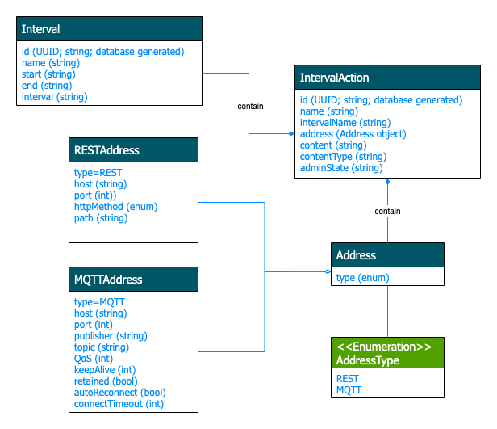
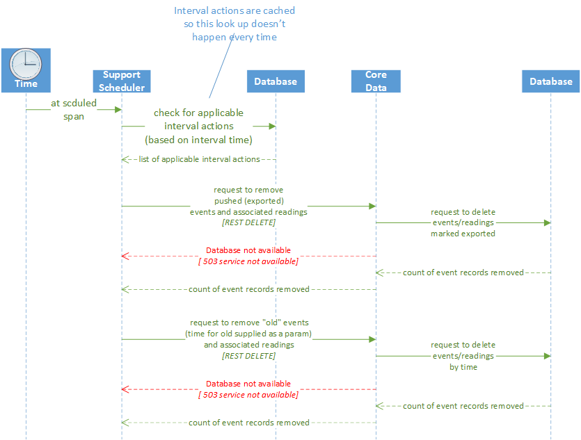

# Scheduling

## Introduction

The support scheduler micro service provide an internal EdgeX “clock” that can kick off operations in any EdgeX service.  At a configuration specified time (called an **interval**), the service calls on any EdgeX service API URL via REST to trigger an operation (called an **interval action**).  For example, the scheduling service periodically calls on core data APIs to clean up old sensed events that have been successfully exported out of EdgeX.

### Default Interval Actions

Scheduled interval actions configured by default with the reference implementation of the service include:

- Clean up Core-data events/readings that have been moved ("pushed") to external applications/systems like a cloud provider. This is the "Scrubbed Pushed" operation. Scheduler parameters around this operation determine how often and where to call into core data to invoke this clean up of unneeded data operation.

- Clean up of Core-data events/readings that have been persisted for an extended period. In order to prevent the edge node from running out of space, these old events/readings are removed. This is the "ScrubAged" operation. Scheduler parameters around this operation determine how often and where to call into Core-data to invoke this operation to expunge of old data.

!!! Note
    The removal of both exported records and stale records occurs on a configurable schedule. By default, both of the default actions above are invoked once a day at midnight.

### Scheduler Persistence

Support scheduler uses a data store to persist the Interval(s) and IntervalAction(s). Persistence is accomplished the Scheduler DB located
in your current configured database for EdgeX.

!!! Info
    Redis DB is used by default to persist all scheduler service information to include intervals and interval actions.

### ISO 8601 Standard

The times and frequencies defined in the scheduler service's intervals are specified using the [international date/time standard - ISO 8601](https://en.wikipedia.org/wiki/ISO_8601).  So, for example, the start of an interval would be represented in YYYYMMDD'T'HHmmss format.  20180101T000000 represents January 1, 2018 at midnight.  Frequencies are represented with ISO 8601 durations. 

## Data Model

## Data Dictionary

=== "Interval"
    |Property|Description|
    |---|---|
    ||An object defining a specific "period" in time|
    |ID|Uniquely identifies an interval, for example a UUID|
    |Created|A timestamp indicating when the interval was created in the database|
  	|Modified|A timestamp indicating when the interval was last modified|
	  |Origin|A timestamp indicating when the original interval was created|
    |Name |the name of the given interval|
    |start|The start time of the given interval in ISO 8601 format|
    |end|The end time of the given interval in ISO 8601 format|
    |frequency |Periodicity of the interval according to ISO 8601|
    |cron|cron styled regular expression indicating how often the action under interval should occur.  Use either runOnce, frequency or cron and not all|
    |runOnce|boolean indicating that this interval runs one time - at the time indicated by the start|
=== "IntervalAction"
    |Property|Description|
    |---|---|
    ||The action triggered by the service when the associated interval occurs|
    |ID|Uniquely identifies an interval action, for example a UUID|
    |Created|A timestamp indicating when the interval action was created in the database|
  	|Modified|A timestamp indicating when the interval action was last modified|
	  |Origin|A timestamp indicating when the original interval action was created|
    |Name |the name of the interval action|
    |Interval|associated interval that defines when the action occurs|
    |Host|The host targeted by the action when it activates|
    |Parameters|paremeters sent in the body of the action call request|
    |Target|The name of the targeted application|
    |Protocol|protocol used when interacting with the targeted host|
    |HTTPMethod |assuming a RESTful operation, the HTTP method to be invoked by the action|
    |Address|assuming a RESTful operation, the HTTP address to be invoked by the action|
    |Port|The port on the targeted host|
    |Path|assuming a RESTful operation, the path to be invoked in combination with the Method and Address|
    |Publisher|assuming a message bus operation, the publisher to be used in invoking the operation via message (future use)|
    |User|username used when the action must be invoked using user based authentication (future use)|
    |Password|password used when the action must be invoked using user based authentication (future use)|
    |Topic|assuming a message bus operation, the topic to push the invoking operation message into|

## High Level Interaction Diagrams

**Scheduler interval actions to expunge old and exported (pushed) records from Core Data**

## Configuration Properties

Please refer to the general [Configuration documentation](../../configuration/Ch-Configuration.md#configuration) for configuration properties common to all services.

=== "Writable"
    |Property|Default Value|Description|
    |---|---|---|
    |||Writable properties can be set and will dynamically take effect without service restart|
    |ScheduleIntervalTime|500|the time, in milliseconds, to trigger any applicable interval actions|
=== "Service"
    |Property|Default Value|Description|
    |---|---|---|
    |MaxResultCount|50000|Maximum number of objects (example: intervals) that are to be returned on any query of core data via its API|
=== "Databases/Databases.Primary"
    |Property|Default Value|Description|
    |---|---|---|
    |||Properties used by the service to access the database|
    |Host|'localhost'|Host running the scheduler persistence database|
    |Name|'scheduler'|Document store or database name|
    |Password|'password'|Password used to access the database|
    |Username|'scheduler'|Username used to access the database|
    |Port|6379|Port for accessing the database service - the Redis port by default|
    |Timeout|5000|Database connection timeout in milliseconds|
    |Type|'redisdb'|Database to use - either redisdb or mongodb|
=== "Intervals/Intervals.Midnight"
    |Property|Default Value|Description|
    |---|---|---|
    |||Default intervals for use with default interval actions|
    |Name|midnight|Name of the every day at midnight interval|
    |Start|20180101T000000|Indicates the start time for the midnight interval which is a midnight, Jan 1, 2018 which effectively sets the start time as of right now since this is in the past|
    |Frequency|24|defines a frequency of every 24 hours|
=== "IntervalActions.IntervalActions.ScrubPushed"
    |Property|Default Value|Description|
    |---|---|---|
    |||Configuration of the core data scrub operation which is to kick off every midnight|
    |Name|'scrub-pushed-events'|name of the interval action|
    |Host|'localhost'|run the request on core data assumed to be on the localhost|
    |Port|48080|run the request against the default core data port|
    |Protocol|'http'|Make a RESTful request to core data|
    |Method|'DELETE'|Make a RESTful delete operation request to core data|
    |Target|'core-data'|target core data|
    |Path|'/api/v1/event/scrub'|request core data's scrub API|
    |Interval|'midnight'|run the operation every midnight as specified by the configuration defined interval|
=== "IntervalActions.IntervalActions.ScrubAged"
    |Property|Default Value|Description|
    |---|---|---|
    |||Configuration of the core data clean old events operation which is to kick off every midnight|
    |Name|'scrub-aged-events'|name of the interval action|
    |Host|'localhost'|run the request on core data assumed to be on the localhost|
    |Port|48080|run the request against the default core data port|
    |Protocol|'http'|Make a RESTful request to core data|
    |Method|'DELETE'|Make a RESTful delete operation request to core data|
    |Target|'core-data'|target core data|
    |Path|'/api/v1/event/removeold/age/604800000'|request core data's remove old events API with parameter of 7 days in milliseconds |
    |Interval|'midnight'|run the operation every midnight as specified by the configuration defined interval|

## API Reference
[Support Scheduler API Reference](../../../api/supporting/Ch-APISupportingServicesScheduling.md)