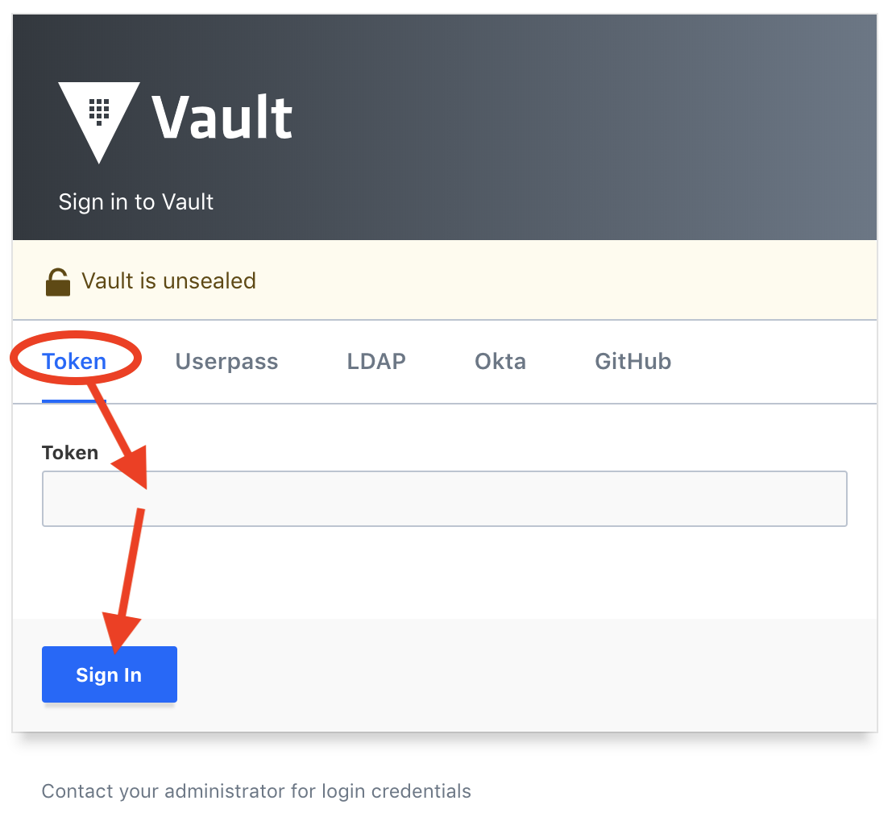
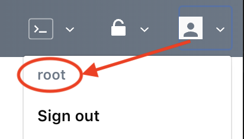

# Secret Store

## Introduction

There are all kinds of secrets used within EdgeX Foundry micro services,
such as tokens, passwords, certificates etc. The secret store serves as
the central repository to keep these secrets. The developers of other
EdgeX Foundry micro services utilize the secret store to create, store
and retrieve secrets relevant to their corresponding micro services.

Currently the EdgeX Foundry secret store is implemented with
[Vault](https://www.vaultproject.io/), a HashiCorp open source software
product.

Vault is a tool for securely accessing secrets. A secret is anything
that you want to tightly control access to, such as API keys, passwords,
database credentials, service credentials, or certificates. Vault
provides a unified interface to any secret, while providing tight access
control and multiple authentication mechanisms (token, LDAP, etc.).
Additionally, Vault supports pluggable "secrets engines".
EdgeX uses the Consul secrets engine to allow Vault to
issue Consul access tokens to EdgeX microservices.

In EdgeX, Vault's storage backend is the host file system.

## Start the Secret Store

The EdgeX secret store is started by default when using 
the secure version of the Docker Compose scripts found at
<https://github.com/edgexfoundry/edgex-compose/tree/ireland>.

The command to start EdgeX with the secret store enabled is:

    git clone -b ireland https://github.com/edgexfoundry/edgex-compose
    make run

or

    git clone -b ireland https://github.com/edgexfoundry/edgex-compose
    make run arm64

The EdgeX secret store is not started if EdgeX is started with security
features disabled by appending `no-secty` to the previous commands.
This disables **all** EdgeX security features, not just the API gateway.

Documentation on how the EdgeX security store is sequenced
with respect to all of the other EdgeX services is covered in the
[Secure Bootstrapping of EdgeX Architecture Decision Record(ADR)](https://docs.edgexfoundry.org/2.0/design/adr/security/0009-Secure-Bootstrapping/).

## Using the Secret Store

### Preferred Approach

The preferred approach for interacting with the EdgeX secret store is to use the
`SecretClient` interface in [go-mod-secrets](https://github.com/edgexfoundry/go-mod-secrets/blob/master/secrets/interfaces.go).

Each EdgeX microservice has access to a `StoreSecrets()` method that allows
setting of per-microservice secrets, and a `GetSecrets()` method to read them back.

If manual "super-user" to the EdgeX secret store is required,
it is necesary to obtain a privileged access token, called the Vault root token.

### Obtaining the Vault Root Token

For security reasons (the 
[Vault production hardening guide](https://learn.hashicorp.com/tutorials/vault/production-hardening)
recommends revokation of the root token), the Vault root token is revoked by default.
EdgeX automatically manages the secrets required by the framework,
and provides a programmatic interface for individual microservices
to interact with their partition of the secret store.

If global access to the secret store is required,
it is necessary to obtain a copy of the Vault root token
using the below recommended procedure.
Note that following this procedure directly contradicts the
[Vault production hardening guide](https://learn.hashicorp.com/tutorials/vault/production-hardening).
Since the root token cannot be un-revoked, the framework
must be started for the first time with root token revokation disabled.

1. Shut down the entire framework and remove the Docker persistent volumes
   using `make clean` in `edgex-compose` or `docker volume prune` after stopping all the containers.
   Optionally remove `/tmp/edgex` as well to clean the shared secrets volume.

2. Edit `docker-compose.yml` and add an environment variable override for `SECRETSTORE_REVOKEROOTTOKENS`

```yaml
  secretstore-setup:
    environment:
      SECRETSTORE_REVOKEROOTTOKENS: "false"
```

3. Start EdgeX using `make run` or some other mechanism.

4. Reveal the contents of the `resp-init.json` file stored in a Docker volume.

```
  docker run --rm -ti -v edgex_vault-config:/vault/config:ro alpine:latest cat /vault/config/assets/resp-init.json
```

5. Extract the `root_token` field value from the resulting JSON output.


As an alternative to overriding `SECRETSTORE_REVOKEROOTTOKENS` from the beginning,
it is possible to regenerate the root token from the Vault unseal keys
in `resp-init.json` 
using the [Vault's documented procedure](https://learn.hashicorp.com/tutorials/vault/generate-root).
The EdgeX framework executes this process internally whenever it requires root token capability.
Note that a token created in this manner will again be revoked the next time EdgeX is restarted
if `SECRETSTORE_REVOKEROOTTOKENS` remains set to its default value: all root tokens
are revoked every time the framework is started if `SECRETSTORE_REVOKEROOTTOKENS` is `true`.


### Using the Vault CLI

Execute a shell session in the running Vault container:

```bash
  docker exec -it edgex-vault sh -l
```

Login to Vault using Vault CLI and the gathered Root Token:

```
edgex-vault:/# vault login s.ULr5bcjwy8S0I5g3h4xZ5uWa
Success! You are now authenticated. The token information displayed below
is already stored in the token helper. You do NOT need to run "vault login"
again. Future Vault requests will automatically use this token.

Key                  Value
---                  -----
token                s.ULr5bcjwy8S0I5g3h4xZ5uWa
token_accessor       Kv5FUhT2XgN2lLu8XbVxJI0o
token_duration       ∞
token_renewable      false
token_policies       ["root"]
identity_policies    []
policies             ["root"]
```

Perform an introspection `lookup` on the current token login.
This proves the token works and is valid.

```
edgex-vault:/# vault token lookup
Key                 Value
---                 -----
accessor            Kv5FUhT2XgN2lLu8XbVxJI0o
creation_time       1623371879
creation_ttl        0s
display_name        root
entity_id           n/a
expire_time         <nil>
explicit_max_ttl    0s
id                  s.ULr5bcjwy8S0I5g3h4xZ5uWa
meta                <nil>
num_uses            0
orphan              true
path                auth/token/root
policies            [root]
ttl                 0s
type                service
```

!!! Note: The Root Token is the only token that has no expiration
    enforcement rules (Time to Live TTL counter).


As an example, let's poke around and spy on the Redis database password:

```
edgex-vault:/# vault list secret 

Keys
----
edgex/

edgex-vault:/# vault list secret/edgex
Keys
----
app-rules-engine/
core-command/
core-data/
core-metadata/
device-rest/
device-virtual/
security-bootstrapper-redis/
support-notifications/
support-scheduler/

edgex-vault:/# vault list secret/edgex/core-data
Keys
----
redisdb

edgex-vault:/# vault read secret/edgex/core-data/redisdb
Key                 Value
---                 -----
refresh_interval    168h
password            9/crBba5mZqAfAH8d90m7RlZfd7N8yF2IVul89+GEaG3
username            redis5
```

With the root token, it is possible to modify any Vault setting.
See the [Vault manual](https://developer.hashicorp.com/vault/docs/commands) for available commands.


### Use the Vault REST API

Vault also supports a REST API with functionality equivalent to the command line interface:

The equivalent of the

```
vault read secret/edgex/core-data/redisdb
```

command looks like the following using the REST API:


Displaying (GET) the redis credentials from Core Data's secret store:

```
curl -s -H 'X-Vault-Token: s.ULr5bcjwy8S0I5g3h4xZ5uWa' http://localhost:8200/v1/secret/edgex/core-data/redisdb | python -m json.tool
{
    "request_id": "9d28ffe0-6b25-c0a8-e395-9fbc633f20cc",
    "lease_id": "",
    "renewable": false,
    "lease_duration": 604800,
    "data": {
        "password": "9/crBba5mZqAfAH8d90m7RlZfd7N8yF2IVul89+GEaG3",
        "username": "redis5"
    },
    "wrap_info": null,
    "warnings": null,
    "auth": null
}
```

See HashiCorp Vault API documentation for further details on syntax and
usage (<https://developer.hashicorp.com/vault/api-docs>).

### Using the Vault Web UI

The Vault Web UI is not exposed via the API gateway.
It must therefore be accessed via `localhost` or a network tunnel of some kind.

Open a browser session on `http://localhost:8200`
and sign-in with the Root Token.



Upper left corner of the current Vault UI session, the sign-out menu
displaying the current token name:



Select the Vault secret backend, and navigate to any secret that is of interest:


The Vault UI also allows entering Vault CLI commands (see above **1st
alternative**) using an embedded console:


## See also

Some of the command used in implementing security services have
man-style documentation:

-   [security-file-token-provider](./security-file-token-provider.1.md) -
    Generate Vault tokens for EdgeX services
-   [secrets-config](./secrets-config.md) - Utility for secrets management.
-   [secrets-config-proxy](./secrets-config-proxy.md) - "proxy" subcommand for managing proxy secrets.
