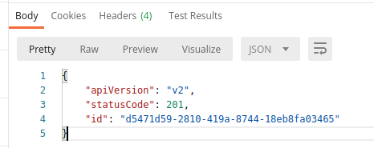

# Sending events and reading data

In the real world, the human/dog counting camera would start to take
pictures, count beings, and send that data to EdgeX. To simulate this
activity in this section of the walkthrough, you will make core data API calls as if you
were the camera's device and device service.  That is, you will report human and dog counts to core data in the form of event/reading objects.

## Send an Event/Reading

See [core data API](https://app.swaggerhub.com/apis-docs/EdgeXFoundry1/core-data/2.0.0) for more details.

Data is submitted to core data as an `Event` object. An event is a collection of
sensor readings from a device (associated to a device by its ID or name)
at a particular point in time. A `Reading` object in an `Event` object is a particular
value sensed by the device and associated to a [Value
Descriptor](./Ch-WalkthroughData.md#value-descriptors) (by name) to
provide context to the reading. 

So, the human/dog counting camera might
determine that there are 5 people and 3 dogs in the space it is
monitoring. In the EdgeX vernacular, the device service upon receiving
these sensed values from the camera device would create an `Event` with two
`Reading`s - one `Reading` would contain the key/value pair of HumanCount:5
and the other `Reading` would contain the key/value pair of CanineCount:3.

The device service, on creating the `Event` and associated `Reading` objects
would transmit this information to core data via REST call.

### Walkthrough - Send Event

Use either the Postman or Curl tab below to walkthrough sending an `Event` with `Reading`s to core data.

=== "Postman"

    Make a POST request to `http://localhost:48080/api/v1/event` with the body below.

    ``` json
    {"device":"countcamera1","readings":[{"name":"HumanCount","value":"5"},{"name":"CanineCount","value":"3"}]}
    ```

    If your API call is successful, you will get a generated ID (a UUID) for your new `Event` as shown in the image below.


    

=== "Curl"

    Make a curl POST request as shown below.

    ``` shell
    curl -X POST -d '{"device":"countcamera1","readings":[{"name":"HumanCount","value":"5"},{"name":"CanineCount","value":"3"}]}' localhost:48080/api/v1/event
    ```

#### Origin Timestamp
If desired, the device service can also supply an origin property in the `Event` or `Reading` object to suggest the time (in Epoch
timestamp/milliseconds format) at which the data was sensed/collected.
If an origin is not provided, no origin will be set for the `Event` or
`Reading`.  However, every `Event` and `Reading` is provided a Created and
Modified timestamp by the database when it is saved to give the data some time context.

``` json
{"device":"countcamera1","origin":1471806386919, "readings":[{"name":"HumanCount","value":"1","origin":1471806386919},{"name":"CanineCount","value":"0","origin":1471806386919}]}
```

!!! Note
    Smart devices will often timestamp sensor data and this timestamp
    can be used as the origin timestamp. In cases where the sensor/device is
    unable to provide a timestamp ("dumb" or brownfield sensors), it is
    recommended that the device service create a timestamp for the sensor
    data that it be applied as the origin timestamp for the device.

## Exploring Events/Readings

Now that an `Event` (or two) and associated `Readings` have been sent to
core data, you can use the core data API to explore that data that is
now stored in the database.

Recall from a [previous walkthrough step](./Ch-WalkthroughCommands.md#walkthrough-events), you checked that no data was yet
stored in core data. Make a similar call to see event records have now been sent into core data..

### Walkthrough - Query Events/Readings

Use either the Postman or Curl tab below to walkthrough getting the list of events.

=== "Postman"

    Make a GET request to retrieve 10 of the last `Event`s associated to the `countcamera1` device: `http://localhost:48080/api/v1/event/device/countcamera1/10`.

    Make a GET request to retrieve 10 of the human count `Reading`s associated to the `countcamera1` device: http://localhost:48080/api/v1/reading/name/HumanCount/10

=== "Curl"

    Make a curl GET requests to retrieve 10 of the last `Event`s associated to the `countcamera1` device and to retrieve 10 of the human count readings associated to `countcamera1`

    ``` shell
    curl -X GET localhost:48080/api/v1/event/device/countcamera1/10 | json_pp
    curl -X GET localhost:48080/api/v1/reading/name/HumanCount/10 | json_pp
    ```

[<Back](Ch-WalkthroughCommands.md){: .md-button } [Next>](Ch-WalkthroughExporting.md){: .md-button }
